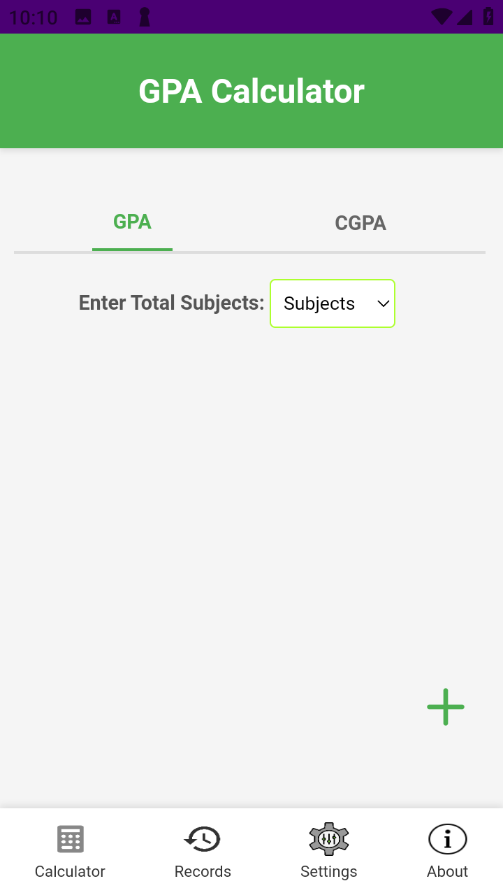
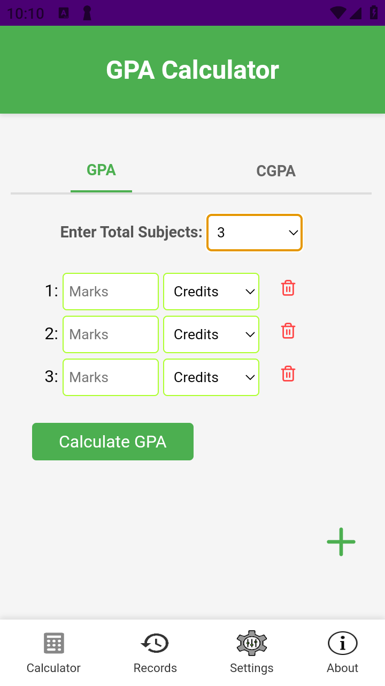
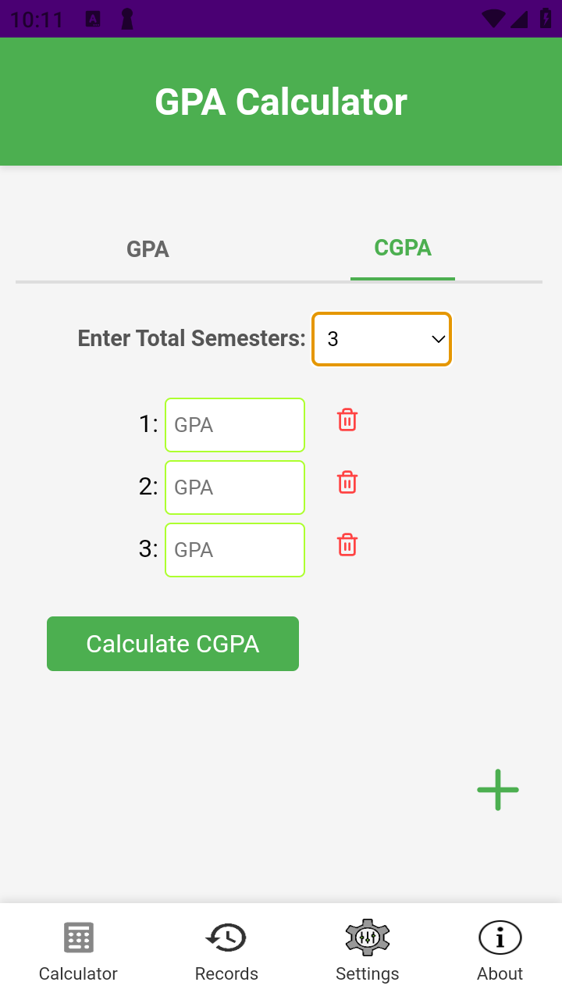
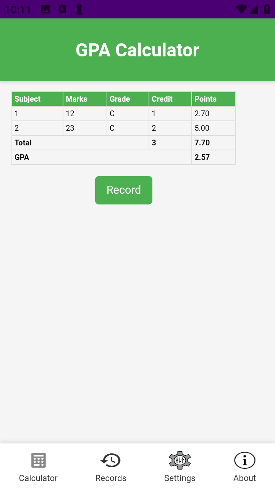
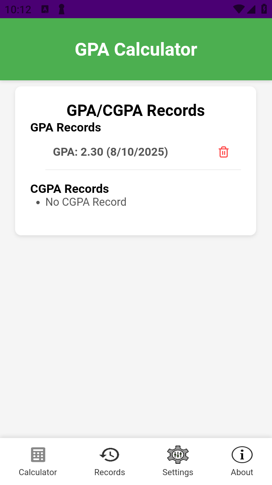
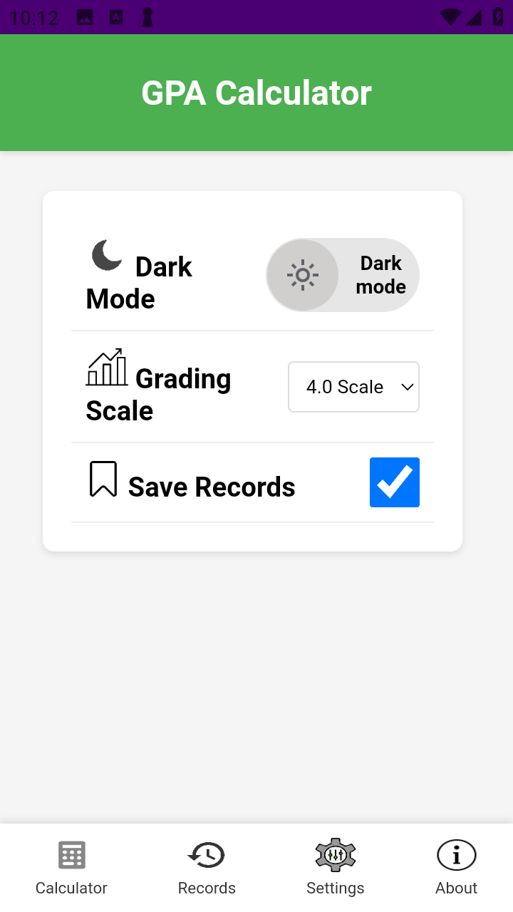
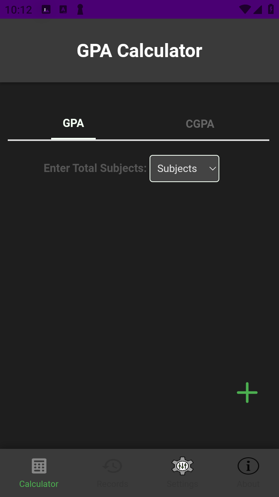
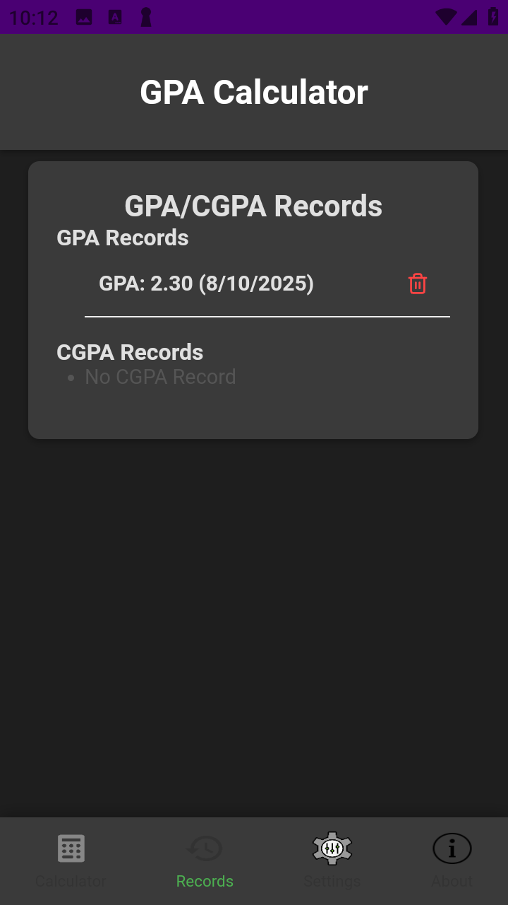

# 🎓 SmartGPA – GPA & CGPA Calculator (GCUF)

**SmartGPA** is a lightweight GPA & CGPA calculator made for **BS-level students at Government College University Faisalabad (GCUF)**.  
It follows **official GCUF grading rules** to give accurate results every time.

---

## ✨ Features
- 📊 Calculate **CGPA** from subject marks & credit hours  
- 📈 Calculate **GPA** from semester CGPAs  
- ✅ 100% based on GCUF grading policy  
- 💡 Simple, clean, and offline-ready

---

## 🧮 How It Works
- **CGPA Mode** → Enter marks & credit hours for each subject  
- **GPA Mode** → Enter CGPAs for all semesters so far  
- App applies GCUF’s formula and shows results instantly

---

## 📸 Screenshots

  
  
  
  
  
  
  
  
  

## 📦 App Info
- **Name:** SmartGPA  
- **Made By:** Janitech  
- **For:** BS Students (GCUF)  
- **Works Offline:** ✅ Yes

---

## 📄 License
MIT License – free to use, modify, and share with credit.
